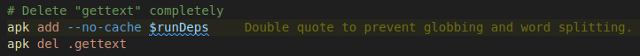
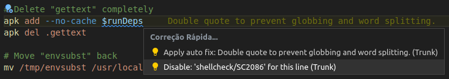
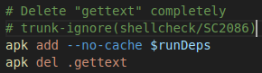

# Trunk Check basic usage and configuration

[Trunk Check](https://docs.trunk.io/docs/check) manages, downloads, and runs dozens of linters, formatters, static analyzers, and security tools.

## Table of contents

- [Trunk Check basic usage and configuration](#trunk-check-basic-usage-and-configuration)
  - [Table of contents](#table-of-contents)
  - [Requirements](#requirements)
  - [Basic operation](#basic-operation)
    - [Versioning](#versioning)
  - [Configurations](#configurations)
    - [Linters](#linters)
    - [Ignore](#ignore)
    - [Config repository](#config-repository)
  - [Main commands](#main-commands)
    - [trunk check](#trunk-check)
    - [trunk fmt](#trunk-fmt)
    - [trunk upgrade](#trunk-upgrade)
  - [References](#references)

## Requirements

[Trunk Check extension](https://marketplace.visualstudio.com/items?itemName=Trunk.io) for VS Code.

## Basic operation

While opening a local git repository with **VS Code**, the extension runs and creates the `.trunk/` directory or uses an existing one.

**Trunk** inspects all files and the project structure and automatically adds the necessary tools, that become listed in the `.trunk/trunk.yaml` file.

Plugins, linters and **trunk** itself are updated frequently. To get new versions, execute the command `trunk upgrade`.

This commands also inspects the repository and add new specific tools for newly added file types.

### Versioning

Trunk initially makes git **ignore** the `.trunk/` dirextory. If you want to version your configs, run:

```bash
trunk config share
```

After this, add and commit your changes:

```bash
git add .trunk/
git commit -m "feat: Add trunk config"
```

## Configurations

### Linters

Linters configuration can usually be done creating files (`.markdownlint.yaml`, `.shellcheckrc`, etc.) in the project root. If using **Trunk Check**, the files must however be placed in the `.trunk/configs/` directory.

- E.g: Disabling line length check in **markdown** files

```yaml
# .trunk/configs/.markdownlint.yaml
---
line_length: false
```

### Ignore

Trunk Check auto ignores files listed in the project `.gitignore`.

If you need that a specific linter ignores a file or file pattern, use the specific linter config for this.

- E.g: Make **markdownlint** ignore Helm template files

```yaml
# .trunk/configs/.yamllint.yaml
---
ignore:
  # Ignore helm templates since they aren't "yaml"
  - "**/templates/*.yml"
  - "**/templates/*.yaml"
```

If you need to ignore a specific check case:

- Move the cursor to the needed line



- Press `Ctrl + .`



- Select the rule and confirm



### Config repository

It can be advantageous to create a specific repository to centralize and organize the common **trunk** configurations for your projects.

E.g:

- [Trunk Official Configs Repo](https://github.com/trunk-io/configs)
- [My Trunk Configs Repo](https://github.com/GustavoAV/trunk-configs)

> Currently it's not possible to use **private** repos for this!

To use a config repo in your project, run:

```bash
trunk plugins add --id=configs https://github.com/GustavoAV/trunk-configs
```

After this, some **local** config elements become unnecessary and thus can be **removed**:

- `.trunk/configs/` directory
- Some `.trunk/trunk.yaml` sections:

```yaml
lint:
  ...
runtimes:
  ...
actions:
  ...
```

At the end, you should have the following `.trunk/trunk.yaml` file:

```yaml
---
version: 0.1
cli:
  version: 1.13.0
plugins:
  sources:
    - id: trunk
      ref: v1.0.0
      uri: https://github.com/trunk-io/plugins
    - id: configs
      ref: v0.0.3
      uri: https://github.com/GustavoAV/trunk-configs
```

## Main commands

### trunk check

Checks project files.

| Option | Description |
| :---- | :-------- |
| `trunk check` | Checks all changed files |
| `trunk check --all` | Checks all files |
| `trunk check [paths...]` | Checks specific files |
| `trunk check enable/disable <linter>` | Enables or disables linter |

> Auto executed with action `trunk-check-pre-push` when running `git push`.

### trunk fmt

Formats project files.

| Option | Description |
| :---- | :-------- |
| `trunk fmt` | Formats all changed files |
| `trunk fmt --all` | Formats all files |
| `trunk fmt [paths...]` | Formats specific files |
| `trunk fmt --no-fix` | Formats files, but do not auto apply fixes |

> Auto executed with action `trunk-fmt-pre-commit` when running `git commit`.

### trunk upgrade

Upgrade **trunk** and configured **linters**.

| Option | Description |
| :---- | :-------- |
| `trunk upgrade` | Upgrade trunk and linters |
| `trunk upgrade --dry-run` | Detects updates, but do not apply |

## References

- [Trunk Docs](https://docs.trunk.io/docs)
- [Trunk Official Configs Repo](https://github.com/trunk-io/configs)
